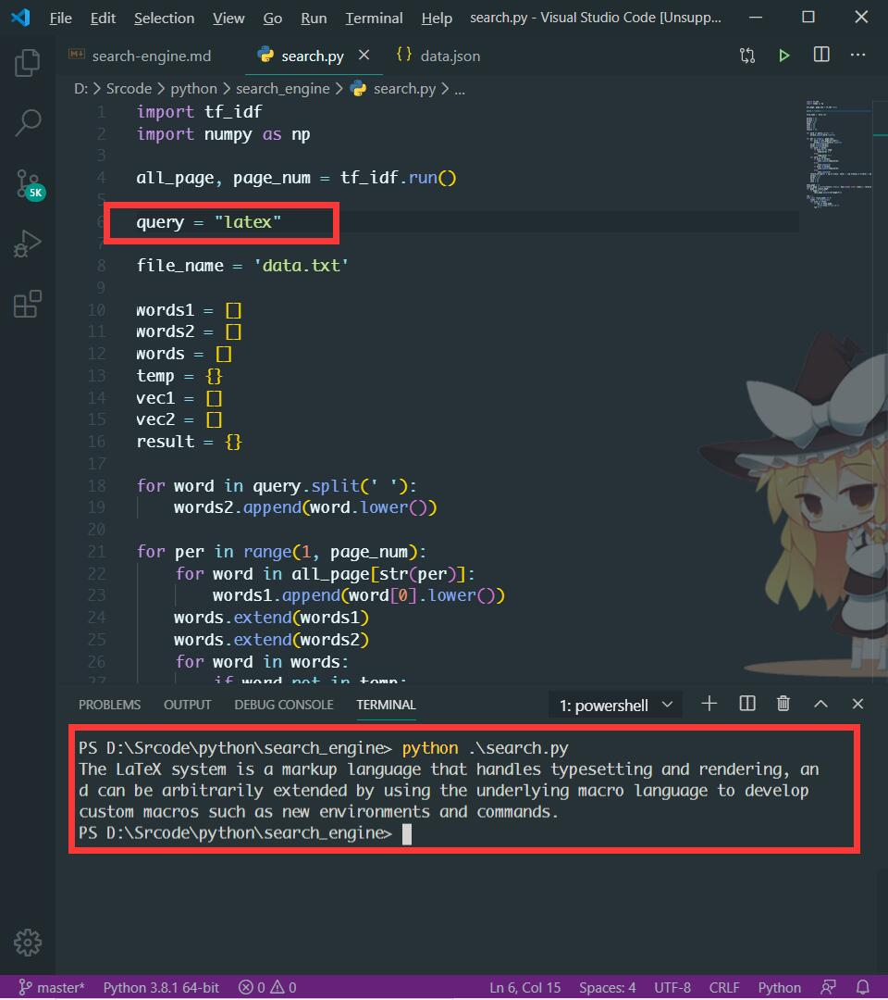

# 介绍

这是我自己做的简易的搜索引擎，以实现相关算法为主，无图形化界面。

只是自己造了个数据库，使用了倒排索引这种数据结构，之后调用`TF-IDF`算法计算每个网页中文章的关键词，用余弦定理求解查询内容和文章关键词之间的相似性。最后计算哪篇文章与查询内容的相似性最高且相似性大于0.5，则展示结果。[更多内容](https://muyuuuu.github.io/2019/05/19/search-engine/)。

因缺失数据，所以选择自己造数据。但自己造的数据中，缺少每个网页之间相互的`link`，所以暂时没有加入`pagerank`算法，如日后找到了带`link`的数据在更新。

- `data.txt`：我自己从`wiki`上搜的一些词汇的描述，**一行描述的数据理解为一个网页**（所以实在没`link`）。数据量很少，且当搜寻内容不在数据库中时会输出`nothing`。
- `Inverted_index.py`：倒排索引的程序，读取`data.txt`数据库，并以倒排索引的形式生成`data.json`文件。
- `tf_idf.py`：计算每行数据（一个网页）中的关键词汇，因数据少，每行文本只保留4个关键词。
- `search.py`：主函数，运行即可输出想要的答案。`query`中输入自己要查询的内容，计算`query`和每篇文章关键词之间的相似性，输出相似性最高的3个网页。

# 使用

`python search.py`即可。

    

